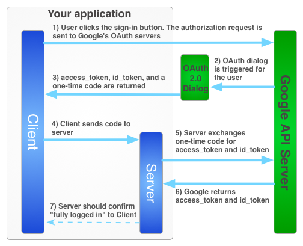

# API Gateway

Microservice responsible for the authentication of the user, and protecting the endpoints of the backend.

To do the authentication, Firebase (from Google) is used to provide a token, and also allow for advanced sign-in
options, and the same token is being used when the authenticated user tries to do a call to the API.

It checks if the user is logged in, and has the necessary role/permissions to do the requested call/action.

## Endpoints

- /public/covid
- /public/data

- /protected/data
- /protected/calendar
- /protected/
- /protected/

- /super/user
- /super/list-users
- /super/create-user
- /super/update-user
- /super/delete-user
- /super/set-claim
- /super/activate-account
- /super/reset-password
- /super/revoke-token

- /session/login
- /session/logout
- /session/me
- /session/create/token

### Firebase Authentication for Spring boot

Firebase is a backendless platform to run applications without a dedicated backend. But, sometimes you may need to
communicate with API of an existing backend, or you may want a dedicated backend to perform operations that cannot be
done through firebase infrastructure.

This **Spring Boot Starter** is perfect for such situations when you want to extend firebase's authentication mechanism
with **Spring Security** to seamlessly create and use protected rest API's.

### Configuration

- Be sure to add the following environment variable globally or project specific run configuration environment
  variable `GOOGLE_APPLICATION_CREDENTIALS=path_to_firebase_server_config.json`

- The starter can be configured to use firebase session as client side / strictly server side or both together.
- Http Only / Secure enabled Session cookies may not work as expected in development hosts (localhost, 120.0.0.1).
  Adding self-signed ssl certificate with reverse proxied host will work perfectly fine. Read this article
  => [Local Domain Names with SSL for development applications ](https://thepro.io/post/local-domain-names-with-ssl-for-local-development-applications-LG)
- Following application properties can edited to customize for your needs.
- In the (not public) '/creds' folder, the Firebase and TLS secrets are stored, which as explained earlier, are passed
  as parameters when executing the project.

### Role Management

- Roles can be added through `SecurityRoleService` during registration of user or manually managed by Super admins
- Super Admins are defined through application property `security.super-admins`
- With roles integrated with spring security, spring authorization annotations
  like **`@Secured, @RolesAllowed, @PreAuthorize, @PostAuthorized`** etc will work out of the box.
- I personally like to define per role annotations like **`@IsSuper`** etc for the sake of simplicity.

```java
    @GetMapping("data")
@isSuper
public String getProtectedData(){
        return"You have accessed seller only data from spring boot";
        }
```

## Environment vars

- GOOGLE_APPLICATION_CREDENTIALS=api-gateway/scripts/car-rental.json
- SUPER_ADMINS=mac12llm2@gmail.com
- CORS_DOMAIN=http://localhost:63343
- SECRET_HASH=xxxxxxx   (used for the encryption and decryption of the user email password stored in firebase)

## RabbitMQ

This microservice, as all the other ones, is using RabbitMQ to communicate between themselves.

RabbitMQ is an open-source general message broker, which supports protocols including MQTT, AMQP and STOMP. It can
handle high-throughput use cases, such as online payment processing. It can handle background jobs or act as a message
broker between microservices.

RabbitMQ is a good option for a simple publish/subscribe message broker, as it will perform better and have an easier
implementation, plus lots of support online due to the large userbase. Kafka would be better in case the messages would
have to be stored even after being read by the subscriber, like in case of metrics analytics.

The RabbitMQ URL is dependent on the profile we are working at, as if we are locally the `localhost` will be used, but
if it is running on Docker, the `rabbitmq` URL (of the Kubernetes cluster) will be used instead.

## Encryption/Decryption

This service needs to store the email password of the user in the Firestore storage DB. To do so, it must be encrypted,
so it is not in plain text and insecure. For this, the AES encryption is being used. The password is hashed with the
password received as an environment variable.

## Spring Profile

Profiles are a core feature of the Spring framework — allowing us to map our beans to different profiles — for example,
dev, test, and prod.

```yaml
spring:
  profiles:
    active: "dev"
  rabbitmq:
    host: localhost
    username: guest
    password: guest
    virtual-host: /
    port: 5672

    ...
```

In this project there are two Spring profiles: "dev" and "docker". Most of the configurations are the same, but one:
spring.rabbitmq.host

- dev: When running on dev profile, which is when developing/running the project locally, the URL for RabbitMQ must be
  set to localhost, as the local instance will be used.
- docker: It only runs in the docker profile when running on Kubernetes. Then, the url must be set to "rabbitmq", which
  is the name set for the loadbalancer in Kubernetes. Without this change, the project wouldn't be able to connect to
  RabbitMQ.

To define the profile to use, is done through the VM parameter:

`-Dspring.profiles.active=dev`

## Docker

As Kubernetes is being used to host the infrastructure of the project, all the microservices must be containerized.

The api-gw, and all the other microservices, have a Dockerfile that builds the image that will later be used by
Kubernetes.

Important to notice that the dockerfile is setting the spring profile to "docker", to use the correct RabbitMQ URL.

```dockerfile
#
# Build stage
#
FROM maven:3.6.0-jdk-11-slim AS build
COPY src /home/app/src
COPY pom.xml /home/app
RUN mvn -f /home/app/pom.xml clean package

#
# Package stage
#
FROM openjdk:11-jre-slim
COPY --from=build /home/app/target/api-gateway-0.0.1-SNAPSHOT.jar /usr/local/lib/api-gateway.jar
EXPOSE 8080
ENTRYPOINT ["java","-jar","/usr/local/lib/api-gateway.jar","-Dspring.profiles.active=docker"]
```

There is also, in the scripts folder, a docker-build.sh script to automatize the creation of the image with the
necessary tag, and its upload to the registry.

## Google Cloud API

To access the Google Calendar API with the user credentials, later needed in Calendar Microservice, there is a complex
flow that must be followed. The main problem, is that Firebase Authentication, even though it includes an option to
sign-in with Google, it does not allow you to ask permission for certain APIs, while Google Sig-in project does.

The first step is to go to [Google developer console](https://console.developers.google.com/apis/library?project=X) and
enable the api that will be used. Then it will generate some OAuth2 credentials in the Credentials section, which must
be configured in your frontend and backend project (clientId and clientSecret, can be seen in the following scripts).

The second step was to partially replace the FirebaseGoogle Sign-in for the Google Sign-in project. I say partially
because now, once the Google sign-in process is completed it returns a credential that is passed to Firebase, so it
knows that it has been authenticated using a 3rd party library.

```js
auth.then(() => {
    auth.grantOfflineAccess({
        'redirect_uri': 'postmessage',
        'prompt': 'consent'
    }).then(offlineAccessExchangeCode => {
        // send offline access exchange code to server ...
        const authResp = auth.currentUser.get().getAuthResponse();
        code = offlineAccessExchangeCode;
        const credential = firebase.auth.GoogleAuthProvider.credential(authResp.id_token);
        return firebase.auth().signInWithCredential(credential);
    }).then(user => {
        createUserAPICall(code)
        protectedCall();
    });
});
```

Once the login is completed, and the user has given permissions to the application to see its calendar,
an `offlineAccessExchangeCode` is generated. This code will then be stored in firestore, in the users document. The code
is a single-use mechanism that allows your backend to retrieve an access and refresh tokens, that will allow you to
connect to the API needed.

To specify the API you request the access to, the "scopes" are used, which indicate the API with a link.



There are some important configurations for this flow to work:

- Once asking for permissions, you must specify that it will work in "offline mode". This is a configuration that allows
  the refresh token to be created in your backend and then use this token to create as many Access Tokens to use the API
  as you want. So once the access token expires (by default after one hour), you can use your refresh token to generate
  a new one.
  ```js
  gapi.load('auth2', function () {
        gapi.auth2.init({
            client_id: '294401568654-agao4nqpvntfa4h9d2ni6h1akqujplh1.apps.googleusercontent.com',
            scope: 'https://www.googleapis.com/auth/calendar'
        });
    });
  ```
- Once the code has been used to retrieve an access and refresh token, it won't be useful anymore, it can be deleted
  from the DB (in this case, Firestore). Instead, you must store the refreshToken in the users document, to later on use
  it once the access token expires.
  ```java
  private GoogleTokenResponse getNewToken(String idToken) throws Exception {
        String code = getCodeToken(idToken);

        GoogleTokenResponse tokenResponse = new GoogleAuthorizationCodeTokenRequest(httpTransport,
                JSON_FACTORY, "https://oauth2.googleapis.com/token", clientId,
                clientSecret, code, redirectURI).execute();

        updateRefreshToken(idToken, tokenResponse);

        return tokenResponse;
    }
  ```
- There is also the redirectURI to be configured. In this case I used the default one, `postmessage`, which is the
  authorization popup that appears to the user.

Some details of the implementation:

- In the Java Spring project, the clientId and redirectUri are configured in the `application.yaml`, while the secret is
  configured as an environment variable.

- There are two differentiated flows, one for the first time, where the `code` is used to retrieve the access and
  refresh tokens, and another one for when only the refresh token is used to get a new accessToken.

Reference links:

- https://developers.google.com/identity/sign-in/web/server-side-flow
- https://stackoverflow.com/questions/14948530/refresh-token-with-google-api-java-client-library
- https://developers.google.com/identity/protocols/oauth2/native-app?hl=RU#choosingredirecturi